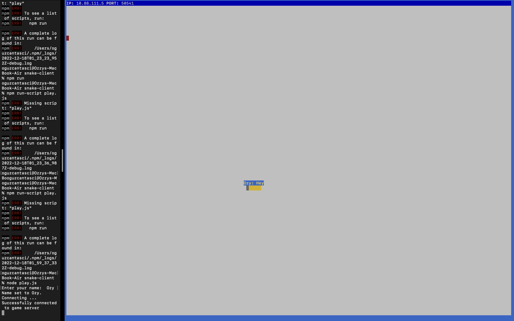

# Snake Client Project

Snake game is a very popular video game. It is a video game concept where the player maneuvers a dot and grows it by ‘eating’ pieces of food. As it moves and eats, it grows and the growing snake becomes an obstacle to smooth maneuvers. The goal is to grow it to become as big as possible without bumping into the side walls, or bumping into itself, upon which it dies.

This is simply a multiplayer take on the genre by me, one and only, [@oguzcantasci](https://github.com/oguzcantasci). 

## Final Product

## How To Install?

- Install `prompt` with the command:

  `npm install prompt`
- Follow steps inside the snek server repo to run the server [here](https://github.com/oguzcantasci/snek-multiplayer).
- Run the snake client with the command:

   `node play.js` 

 ## How To Play?

- Enter your name when you firs run the client.
- Move the snake `up, down, left, rigth` with `W, S, A, D` keys respectively.
- Send messages to be displayed above your snake with I, J, K, L keys.
- Press `Ctrl + C` when you want to quit the game.

## Credits

The server code for this game is a  modified version of the single player game Snek created by [Tania Rascia](https://www.taniarascia.com/).